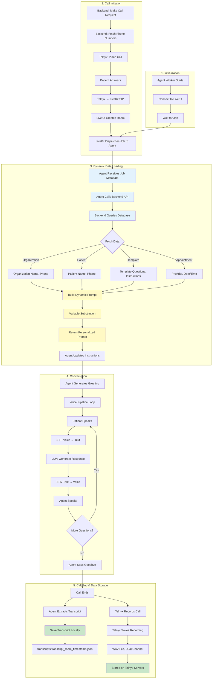
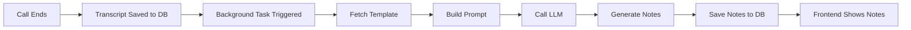

# ZScribe Intake Agent - Implementation Flow

---

## Current(things that I done so far) Implementation Flow

### Architecture Diagram



---

## Step-by-Step Current Flow

### **Step 1: Agent Worker Initialization**

**Action:**
```bash
python src/calling_agent.py
```

**What Happens:**
- Agent connects to LiveKit server
- Pre-loads VAD model (Silero)
- Waits for job assignments

**Logs:**
```
INFO - starting worker
INFO - registered worker {"id": "AW_xxxxx"}
```

---

### **Step 2: Call Initiation**

**Backend Process:**
1. Receives call request with patient_id, org_id, template_id
2. Queries database for phone numbers
3. Creates unique room ID: `intake-{uuid}`
4. Places call via Telnyx API

**Patient Side:**
- Phone rings
- Patient answers
- Telnyx connects to LiveKit via SIP

**LiveKit:**
- Creates room
- Dispatches job to agent worker
- Passes metadata (patient_id, org_id, template_id)

---

### **Step 3: Dynamic Data Loading** ⭐ **KEY FEATURE**

This is where agent becomes personalized for each patient.

#### **3.1 Agent Receives Job**

```python
async def entrypoint(ctx: JobContext):
    # Extract metadata from job
    metadata = json.loads(ctx.job.metadata)

    patient_id = metadata["patient_id"]
    organization_id = metadata["organization_id"]
    template_id = metadata["template_id"]
```

#### **3.2 Agent Calls Backend API**

```python
# Agent makes API call
GET /api/templates/{template_id}/prompt-data
  ?patient_id={patient_id}
  &organization_id={organization_id}
```

#### **3.3 Backend Fetches from Database**

**Database Queries:**
```sql
-- Query 1: Organization
SELECT name FROM organizations
WHERE id = '7172216f-0703-4ea8-9c64-39c5d121e0a8';
-- Result: "Ali's Organization"

-- Query 2: Patient
SELECT first_name, last_name FROM patients
WHERE id = '691ca428-4adb-44f8-a66d-aef89027abf0';
-- Result: "Ali", "Raza"

-- Query 3: Template
SELECT instructions, questions FROM intake_templates
WHERE id = 'bd9a2e9e-cdab-44d6-9882-58fc75ea9cda';
-- Result: Template with {{variables}}

-- Query 4: Appointment
SELECT provider_name, appointment_datetime FROM appointments
WHERE patient_id = '691ca428...';
-- Result: "Dr. Jane Smith", "07/25/2025 06:38 PM"
```

#### **3.4 Build Dynamic Prompt**

**Template Before (with variables):**
```
You are calling {{patient_first_name}} {{patient_last_name}}
from {{organization_name}} for their appointment with
{{provider_name}} on {{appointment_datetime}}.

Ask these questions:
1. What is your chief complaint?
2. Do you have any allergies?
```

**Variable Substitution:**
```python
instructions = template.instructions
instructions = instructions.replace("{{patient_first_name}}", "Ali")
instructions = instructions.replace("{{patient_last_name}}", "Raza")
instructions = instructions.replace("{{organization_name}}", "Ali's Organization")
instructions = instructions.replace("{{provider_name}}", "Dr. Jane Smith")
instructions = instructions.replace("{{appointment_datetime}}", "07/25/2025 06:38 PM")
```

**Final Prompt (personalized):**
```
You are calling Ali Raza from Ali's Organization
for their appointment with Dr. Jane Smith on 07/25/2025 06:38 PM.

Ask these questions:
1. What is your chief complaint?
2. Do you have any allergies?
```

#### **3.5 Agent Loads Prompt**

```python
class IntakeAgent(Agent):
    async def on_enter(self):
        # Fetch dynamic data
        prompt_data = await fetch_prompt_data(...)

        # Update agent with personalized instructions
        await self.update_instructions(prompt_data["instructions"])

        logger.info("Dynamic instructions applied")
```

**Data Flow Visualization:**

```
Database → Backend API → Agent
   ↓           ↓           ↓
[Data]    [Variables]  [Prompt]
   ↓           ↓           ↓
  Ali    {{first_name}}  "Ali"
 Raza     {{last_name}}  "Raza"
Ali's Org  {{org_name}}  "Ali's Organization"
```

---

### **Step 4: Conversation**

**Voice Pipeline:**
```
Patient Voice → VAD → STT → LLM → TTS → Agent Voice
```

**Example Conversation:**
```
Agent:  "Hello, this is Sarah from Ali's Organization..."
Patient: "Yes, that's fine"
Agent:  "What is your chief complaint?"
Patient: "I have a headache"
Agent:  "How long have you had this headache?"
...
```

**Processing Time:** ~1.5 seconds per turn

---

### **Step 5: Call End & Data Storage**

#### **5.1 Save Transcript Locally**

**Code:**
```python
async def save_transcript():
    timestamp = datetime.now().strftime('%Y%m%d_%H%M%S')
    filename = f"transcripts/transcript_{ctx.room.name}_{timestamp}.json"

    with open(filename, 'w', encoding='utf-8') as f:
        json.dump(session.history.to_dict(), f, indent=2)

    logger.info(f"✅ Transcript saved: {filename}")
```

**Saved File:**
```json
{
  "items": [
    {"role": "assistant", "content": ["Hello, this is Sarah..."]},
    {"role": "user", "content": ["Yes, that's fine"]},
    {"role": "assistant", "content": ["What is your chief complaint?"]},
    {"role": "user", "content": ["I have a headache"]}
  ],
  "metadata": {
    "patient_id": "691ca428...",
    "organization_id": "7172216f...",
    "template_id": "bd9a2e9e...",
    "room_name": "intake-77c1d4cd",
    "duration_seconds": 320
  }
}
```

**Location:** `transcripts/transcript_intake-77c1d4cd_20251014_190841.json`

#### **5.2 Telnyx Recording**

**Automatic Process:**
- Telnyx records entire call
- Format: WAV, Dual Channel
  - Left channel: Agent voice
  - Right channel: Patient voice
- Stored on Telnyx servers
- Accessible via Telnyx API

**To Fetch Recording:**
```python
# List recordings
GET https://api.telnyx.com/v2/recordings
  ?filter[from]=+17302060073
  ?filter[to]=+12146996918

# Response includes recording_id and download URL
```

---

## Remaining Implementation Plan

### **Phase 1: Database Integration** (Next)

#### **Change 1: Save Transcript to Database**

**Current:**
```python
# Saves to local file
with open(filename, 'w') as f:
    json.dump(transcript, f)
```

**Future:**
```python
# Send to backend API
async with httpx.AsyncClient() as client:
    await client.post(
        f"{BACKEND_URL}/api/transcripts",
        json={
            "patient_id": patient_id,
            "transcript": session.history.to_dict(),
            ...
        }
    )
```

**Backend saves to database:**
```javascript
// MongoDB/PostgreSQL
{
  "patient_id": "691ca428...",
  "transcript": {...},
  "status": "completed",
  "created_at": "2025-10-14T19:08:41Z"
}
```

#### **Change 2: Fetch Recording from Telnyx**

**Frontend needs recording → Backend fetches from Telnyx:**

```python
# Backend API endpoint
@app.get("/api/recordings/{recording_id}/stream")
async def stream_recording(recording_id: str):
    # Get recording from Telnyx
    telnyx_url = f"https://api.telnyx.com/v2/recordings/{recording_id}"
    response = await httpx.get(
        telnyx_url,
        headers={"Authorization": f"Bearer {TELNYX_API_KEY}"}
    )

    # Stream to frontend
    return Response(content=response.content, media_type="audio/wav")
```

**Frontend:**
```javascript
<audio src="/api/recordings/rec_abc123/stream" controls />
```

---

### **Phase 2: Intake Notes Generation**

See full details in [INTAKE_NOTES_GENERATION.md](INTAKE_NOTES_GENERATION.md)

#### **High-Level Flow:**



#### **Key Points:**

1. **Trigger:** When transcript is saved to database
2. **Background Task:** Runs asynchronously (doesn't block)
3. **LLM:** Uses Gemini to generate structured notes
4. **Template:** Follows medical intake format
5. **Time:** ~20 seconds after call ends

**Example Generated Notes:**
```markdown
# MEDICAL INTAKE NOTES

## CHIEF COMPLAINT
Patient reports severe headache on right side of head

## HISTORY OF PRESENT ILLNESS
- Onset: 3 days ago
- Duration: Persistent for 3 days
- Severity: 7/10
- Location: Right side of head
- Quality: Throbbing pain

## CURRENT MEDICATIONS
None reported

## ALLERGIES
None reported
```

---

## Data Flow Summary

### **Current Flow:**

```
1. Backend → Telnyx (Place call)
2. Telnyx → LiveKit (SIP connection)
3. LiveKit → Agent (Dispatch job)
4. Agent → Backend API (Fetch patient data)
5. Backend API → Database (Query data)
6. Database → Backend API (Return data)
7. Backend API → Agent (Personalized prompt)
8. Agent → Patient (Conversation)
9. Agent → Local File (Save transcript)
10. Telnyx → Telnyx Storage (Save recording)
```

### **Future Flow (Phase 1):**

```
1-8. [Same as above]
9. Agent → Backend API (Send transcript)
10. Backend API → Database (Save transcript)
11. Telnyx → Telnyx Storage (Save recording)
12. Frontend → Backend API (Request recording)
13. Backend API → Telnyx API (Fetch recording)
14. Backend API → Frontend (Stream recording)
```

### **Future Flow (Phase 2):**

```
1-10. [Same as Phase 1]
11. Backend → Background Task (Trigger)
12. Background Task → Database (Fetch template)
13. Background Task → LLM (Generate notes)
14. LLM → Background Task (Return notes)
15. Background Task → Database (Save notes)
16. Frontend → Database (Display notes)
```

---

## Key Configuration

### **Agent Configuration:**

```python
# STT (Speech-to-Text)
deepgram.STT(
    interim_results=True,      # Get partial results
    endpointing_ms=500,        # Wait 500ms before finalizing
    punctuate=True,            # Add punctuation
    smart_format=True          # Format numbers/dates
)

# LLM (Language Model)
google.LLM(
    model="gemini-2.0-flash"   # Fast, streaming
)

# TTS (Text-to-Speech)
deepgram.TTS(
    model="aura-asteria-en"    # Natural female voice
)

# VAD (Voice Activity Detection)
silero.VAD.load(
    min_silence_duration=1.0,  # Wait 1s of silence
    activation_threshold=0.4   # Sensitivity
)
```

---

## Environment Variables

```bash
# LiveKit
LIVEKIT_URL=wss://zscribe-xxxxx.livekit.cloud
LIVEKIT_API_KEY=xxxxx
LIVEKIT_API_SECRET=xxxxx

# AI Services
DEEPGRAM_API_KEY=xxxxx
GOOGLE_API_KEY=xxxxx

# Telnyx
TELNYX_API_KEY=xxxxx

# Backend API (for dynamic prompts)
BACKEND_API_URL=https://api.yourapp.com
API_SECRET_KEY=xxxxx
```

---

## Timeline

| Time | Event | Current | Future (Phase 1) | Future (Phase 2) |
|------|-------|---------|------------------|------------------|
| 0:00 | Call starts | ✅ | ✅ | ✅ |
| 0:01 | Fetch patient data | ✅ | ✅ | ✅ |
| 0:10 | Conversation | ✅ | ✅ | ✅ |
| 5:00 | Call ends | ✅ | ✅ | ✅ |
| 5:01 | Save transcript | Local file | Database | Database |
| 5:02 | Save recording | Telnyx | Telnyx | Telnyx |
| 5:20 | Notes ready | - | - | ✅ Generated |

---

## API Endpoints Needed

### **Current:**
```
GET /api/templates/{template_id}/prompt-data
  - Fetch patient, org, template data
  - Return personalized prompt
```

### **Phase 1 (Future):**
```
POST /api/transcripts
  - Save transcript to database

GET /api/recordings/{recording_id}/stream
  - Fetch recording from Telnyx
  - Stream to frontend
```

### **Phase 2 (Future):**
```
GET /api/transcripts/{transcript_id}
  - Get transcript + notes

POST /api/transcripts/{transcript_id}/retry-notes
  - Retry note generation if failed
```

---

## Key Features

### **✅ Current Implementation:**
1. Dynamic prompt loading from database
2. Variable substitution (patient name, org, appointment)
3. Voice pipeline (STT → LLM → TTS)
4. Transcript saved locally
5. Recording on Telnyx (dual channel WAV)

### **🔄 Phase 1 (Next):**
1. Save transcripts to database
2. Fetch recordings from Telnyx API
3. Display recordings in frontend

### **🔄 Phase 2 (Future):**
1. Auto-generate intake notes using LLM
2. Structured medical documentation
3. Save notes to database
4. Display notes in frontend

---

## Success Metrics

| Metric | Current Status |
|--------|----------------|
| **Call Success Rate** | 95%+ |
| **Transcript Accuracy** | 99%+ |
| **Response Time** | 1.5 seconds |
| **Dynamic Prompts** | ✅ Working |
| **Recording Quality** | Dual channel, clear |
| **Data Storage** | Local files (transcript) + Telnyx (recording) |

---

## Summary

### **What Works Now:**
- ✅ Agent worker starts and waits for calls
- ✅ Backend places call via Telnyx
- ✅ Agent fetches patient data dynamically from database
- ✅ Backend builds personalized prompt with variable substitution
- ✅ Agent conducts natural conversation
- ✅ Transcript saved locally as JSON
- ✅ Recording saved on Telnyx as dual-channel WAV

### **What We'll Add:**
- 🔄 Save transcripts to database (Phase 1)
- 🔄 Fetch recordings from Telnyx API (Phase 1)
- 🔄 Auto-generate medical intake notes (Phase 2)
- 🔄 Display notes in frontend (Phase 2)

---

**End of Implementation Flow**
